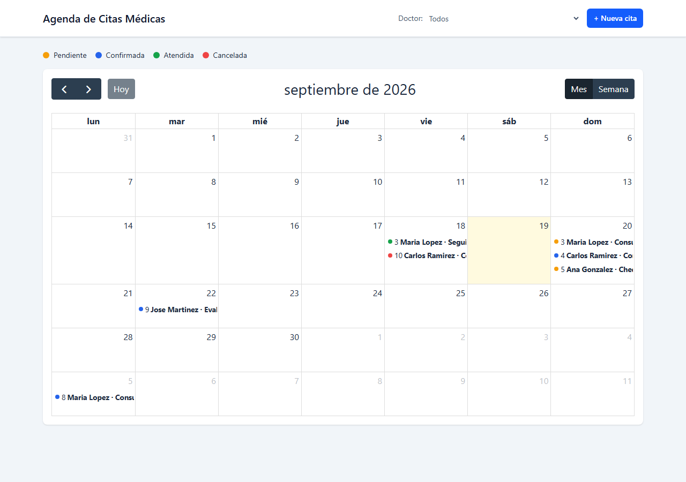
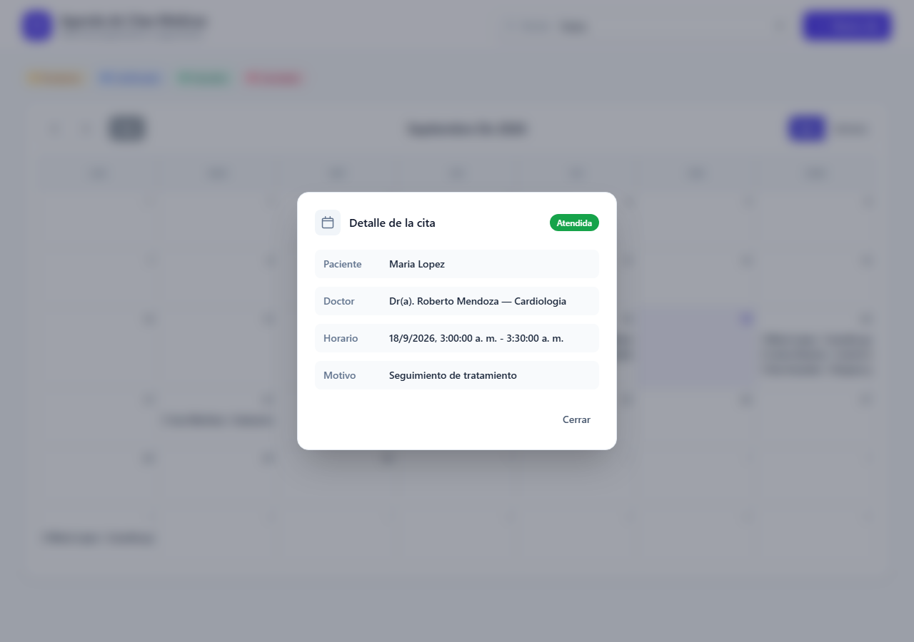
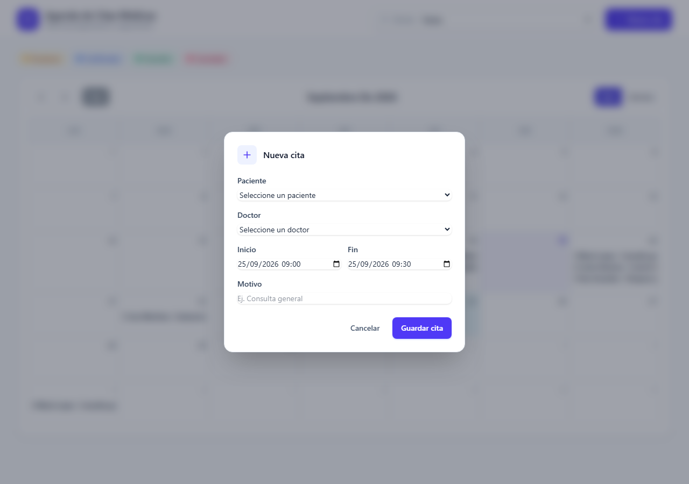
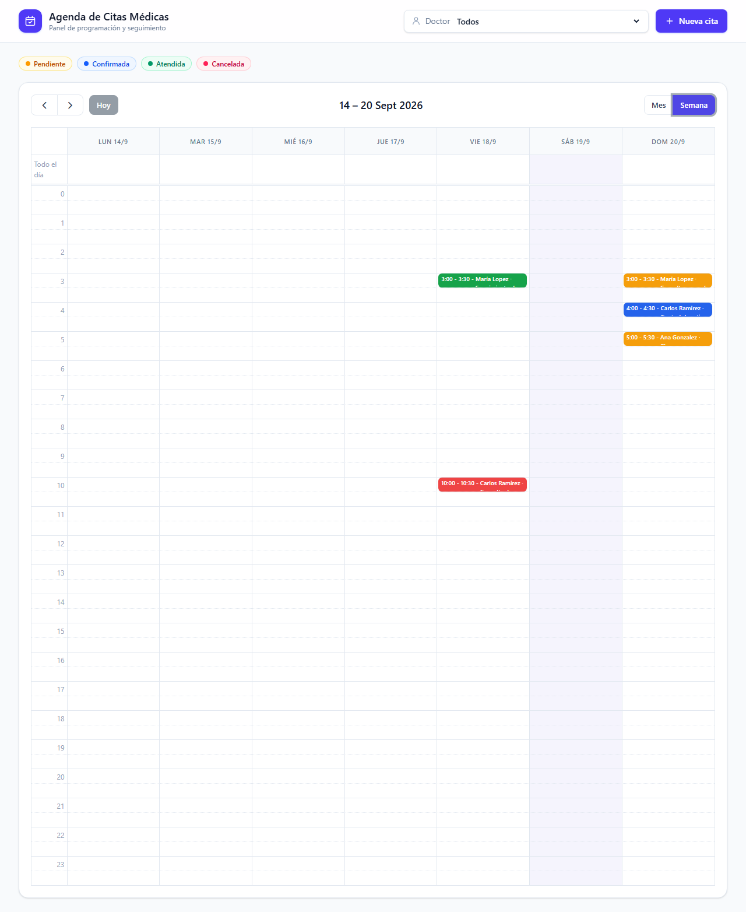
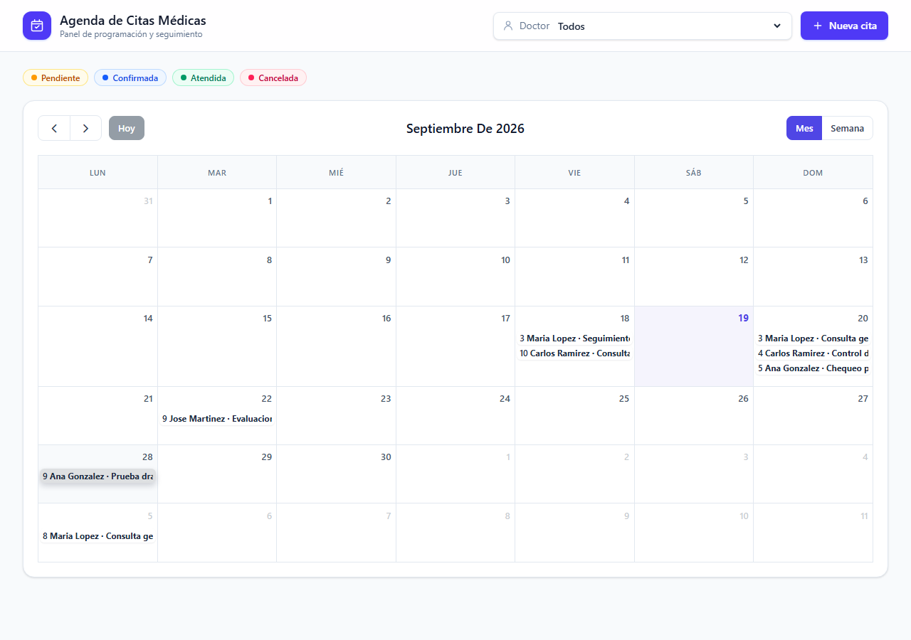

# Evidencia — Serie II

## 1. Backlog y trazabilidad

| Rama | RQF cubiertos | RQNF cubiertos | Pull Request |
|---|---|---|---|
| `feature/docker-mysql-schema` | RQF-01 | RQNF-01, RQNF-02, RQNF-04 | [#1](https://github.com/Glendi20/SegundoParcial_GlendiCampos/pull/1) |
| `feature/api-rest-citas` | RQF-06, RQF-07, RQF-08 | RQNF-03, RQNF-04 | [#2](https://github.com/Glendi20/SegundoParcial_GlendiCampos/pull/2) |
| `feature/validacion-conflictos-estados` | RQF-03, RQF-05 | RQNF-03, RQNF-07 | [#3](https://github.com/Glendi20/SegundoParcial_GlendiCampos/pull/3) |
| `feature/fullcalendar-ui` | RQF-02, RQF-04, RQF-09, RQF-10 | RQNF-06 | [#4](https://github.com/Glendi20/SegundoParcial_GlendiCampos/pull/4) |
| `fix/interfaz-profesional` | RQF-09, RQF-10 | RQNF-06 | [#5](https://github.com/Glendi20/SegundoParcial_GlendiCampos/pull/5) |

Cada Pull Request incluye descripción, lista de RQF/RQNF cubiertos y evidencia, y fue fusionado a `main` con el botón *Merge pull request* de GitHub (merge commit).

## 2. Docker — MySQL con persistencia

```bash
docker compose up -d
```

Salida de `docker ps`:

```
CONTAINER ID   IMAGE          COMMAND                  CREATED          STATUS                    PORTS                                         NAMES
7f4846689b0c   phpmyadmin:5   "/docker-entrypoint.…"   10 minutes ago   Up 10 minutes             0.0.0.0:8081->80/tcp, [::]:8081->80/tcp      citas_phpmyadmin
fb84d568eced   mysql:8.0      "docker-entrypoint.s…"   10 minutes ago   Up 10 minutes (healthy)   0.0.0.0:3307->3306/tcp, [::]:3307->3306/tcp  citas_mysql
```

MySQL 8 corre exclusivamente en Docker (puerto de host `3307` para no chocar con ningún motor local), con persistencia en el volumen nombrado `mysql_data`. phpMyAdmin queda disponible en `http://127.0.0.1:8081`.

## 3. Migraciones y datos semilla

```bash
php artisan migrate --seed
```

```
INFO  Preparing database.
Creating migration table ................................................. DONE

INFO  Running migrations.
0001_01_01_000000_create_users_table ...................................... DONE
0001_01_01_000001_create_cache_table ....................................... DONE
0001_01_01_000002_create_jobs_table ........................................ DONE
2026_09_19_134151_create_doctores_table .................................... DONE
2026_09_19_134151_create_pacientes_table ................................... DONE
2026_09_19_134152_create_citas_table ....................................... DONE

INFO  Seeding database.
Database\Seeders\PacienteSeeder ............................................ DONE
Database\Seeders\DoctorSeeder ............................................... DONE
Database\Seeders\CitaSeeder ................................................. DONE
```

Quedan sembrados 5 pacientes, 4 doctores y 6 citas (en distintos estados: pendiente, confirmada, cancelada, atendida).

## 4. API REST — evidencia de endpoints

Todas las pruebas se ejecutaron contra `http://127.0.0.1:8000` (Laravel) con MySQL corriendo en Docker.

### 4.1 Listar doctores — `GET /api/doctores` (200)

```bash
curl http://127.0.0.1:8000/api/doctores
```

```json
{"data":[
  {"id":1,"nombre":"Eduardo","apellido":"Castillo","nombre_completo":"Dr(a). Eduardo Castillo","especialidad":"Medicina General","telefono":"98001122","email":"eduardo.castillo@clinica.com"},
  {"id":2,"nombre":"Patricia","apellido":"Vasquez","nombre_completo":"Dr(a). Patricia Vasquez","especialidad":"Pediatria","telefono":"98002233","email":"patricia.vasquez@clinica.com"},
  {"id":3,"nombre":"Roberto","apellido":"Mendoza","nombre_completo":"Dr(a). Roberto Mendoza","especialidad":"Cardiologia","telefono":"98003344","email":"roberto.mendoza@clinica.com"},
  {"id":4,"nombre":"Silvia","apellido":"Reyes","nombre_completo":"Dr(a). Silvia Reyes","especialidad":"Dermatologia","telefono":"98004455","email":"silvia.reyes@clinica.com"}
]}
```

### 4.2 Crear una cita — `POST /api/citas` (201)

```bash
curl -X POST http://127.0.0.1:8000/api/citas \
  -H "Content-Type: application/json" \
  -d '{"paciente_id":1,"doctor_id":1,"inicio":"2026-10-05 09:00:00","fin":"2026-10-05 09:30:00","motivo":"Consulta general"}'
```

`HTTP 201`

```json
{"data":{"id":7,"paciente":{"id":1,"nombre_completo":"Maria Lopez", "..."},"doctor":{"id":1,"nombre_completo":"Dr(a). Eduardo Castillo","..."},"inicio":"2026-10-05T09:00:00+00:00","fin":"2026-10-05T09:30:00+00:00","motivo":"Consulta general","estado":"pendiente","estado_label":"Pendiente","color":"#f59e0b"}}
```

### 4.3 Conflicto de horario — `POST /api/citas` (409, RQF-03 / RQNF-07)

```bash
curl -X POST http://127.0.0.1:8000/api/citas \
  -H "Content-Type: application/json" \
  -d '{"paciente_id":2,"doctor_id":1,"inicio":"2026-10-05 09:15:00","fin":"2026-10-05 09:45:00","motivo":"Otra consulta"}'
```

`HTTP 409`

```json
{"message":"El doctor seleccionado ya tiene una cita activa que se solapa con ese horario."}
```

### 4.4 Datos inválidos — `POST /api/citas` (400)

```bash
curl -X POST http://127.0.0.1:8000/api/citas \
  -H "Content-Type: application/json" \
  -d '{"paciente_id":null,"doctor_id":null,"inicio":"","fin":"","motivo":""}'
```

`HTTP 400`

```json
{"message":"The paciente id field is required. (and 4 more errors)","errors":{"paciente_id":["The paciente id field is required."],"doctor_id":["The doctor id field is required."],"inicio":["The inicio field is required."],"fin":["The fin field is required."],"motivo":["The motivo field is required."]}}
```

### 4.5 Cita inexistente — `GET /api/citas/999999` (404)

```bash
curl http://127.0.0.1:8000/api/citas/999999
```

`HTTP 404`

```json
{"message":"Recurso no encontrado."}
```

### 4.6 Reprogramar — `PUT /api/citas/{id}` (200)

```bash
curl -X PUT http://127.0.0.1:8000/api/citas/7 \
  -H "Content-Type: application/json" \
  -d '{"inicio":"2026-10-05 14:00:00","fin":"2026-10-05 14:30:00"}'
```

`HTTP 200` — la cita queda con `inicio: "2026-10-05T14:00:00+00:00"`.

### 4.7 Cambiar estado — `PATCH /api/citas/{id}/estado` (200)

```bash
curl -X PATCH http://127.0.0.1:8000/api/citas/7/estado \
  -H "Content-Type: application/json" \
  -d '{"estado":"confirmada"}'
```

`HTTP 200` — la cita queda con `estado: "confirmada"`, `color: "#2563eb"`.

## 5. Pruebas automatizadas

```bash
php artisan test
```

```
PASS  Tests\Feature\CitaApiTest
✓ crea una cita correctamente
✓ rechaza datos invalidos con 400
✓ rechaza doble reserva para el mismo doctor con 409
✓ permite agendar con otro doctor en el mismo horario
✓ una cita cancelada no bloquea el horario
✓ reprograma una cita con drag and drop
✓ no reprograma si genera conflicto con otra cita
✓ cambia el estado de una cita
✓ devuelve 404 para una cita inexistente
✓ lista citas filtrando por doctor y rango de fechas
✓ lista doctores y pacientes

PASS  Tests\Feature\ExampleTest
✓ the application returns a successful response

Tests:    13 passed (23 assertions)
```

`./vendor/bin/pint` (estilo de código): `passed`.

## 6. Interfaz — FullCalendar

Probado con Playwright (Chromium headless) contra la app real, sin errores de consola.

- 
- 
- 
- 
- 

**Nota de zona horaria:** el `<input type="datetime-local">` y los eventos de `dateClick`/`eventDrop` de FullCalendar no llevan offset de zona horaria; `resources/js/calendario.js` los convierte explícitamente a UTC (`Date.prototype.toISOString()`) antes de enviarlos a la API, de modo que la hora que ve el usuario en su navegador coincide con la que se guarda, sin importar la zona horaria del servidor (`config/app.php` usa `UTC`).

## 7. Historial Git

```bash
git log --graph --oneline
```

```
*   304007a Merge pull request #5 from Glendi20/fix/interfaz-profesional
|\
| * b4d6197 mejora el diseño de la interfaz: header con marca, tema personalizado de FullCalendar, modales pulidos (RQF-09, RQF-10, RQNF-06)
|/
*   fb758a0 Merge pull request #4 from Glendi20/feature/fullcalendar-ui
|\
| * 04b7c0c agrega evidencia de ejecucion: docker, api, tests y capturas
| * 7e8816a integra FullCalendar con crear, detalle, drag & drop y colores por estado (RQF-04, RQF-09, RQF-10, RQNF-06)
| * 2a869d4 agrega controlador de la vista de calendario
| * dde7fbb agrega FullCalendar y Alpine.js como dependencias (RQF-02)
|/
*   cfa2ad1 Merge pull request #3 from Glendi20/feature/validacion-conflictos-estados
|\
| * c48ffee agrega excepcion de conflicto de horario para citas (RQF-03, RQNF-07)
|/
*   266cfe3 Merge pull request #2 from Glendi20/feature/api-rest-citas
|\
| * f6bc6cc agrega controladores y rutas REST de citas, doctores y pacientes (RQF-06, RQF-07, RQNF-03)
| * 3e49bc6 agrega CitaService, DoctorService y PacienteService (RQNF-04)
| * 2ecc256 agrega form requests y resources para citas, doctores y pacientes (RQF-08)
|/
*   543e922 Merge pull request #1 from Glendi20/feature/docker-mysql-schema
|\
| * b936746 completa el esqueleto de Laravel: bootstrap, config, storage y proveedor de servicios (RQNF-04)
| * 69cc0a8 agrega modelos, factories y datos semilla minimos (RQF-01)
| * 9441de8 crea migraciones de pacientes, doctores y citas con enum de estado (RQF-01
| * 7880c58 crea migraciones de pacientes, doctores y citas con enum de estado (RQF-01
| * 8657030 agrega docker
| * 0275254 agrega docker-compose con MySQL 8 y persistencia por volumen (RQNF-01, RQNF-02
|/
* 5332d72 subiendo readme
```

Pull Requests fusionados a `main`:

1. [#1 `feature/docker-mysql-schema`](https://github.com/Glendi20/SegundoParcial_GlendiCampos/pull/1) — merge `543e922`
2. [#2 `feature/api-rest-citas`](https://github.com/Glendi20/SegundoParcial_GlendiCampos/pull/2) — merge `266cfe3`
3. [#3 `feature/validacion-conflictos-estados`](https://github.com/Glendi20/SegundoParcial_GlendiCampos/pull/3) — merge `cfa2ad1`
4. [#4 `feature/fullcalendar-ui`](https://github.com/Glendi20/SegundoParcial_GlendiCampos/pull/4) — merge `fb758a0`
5. [#5 `fix/interfaz-profesional`](https://github.com/Glendi20/SegundoParcial_GlendiCampos/pull/5) — merge `304007a`
